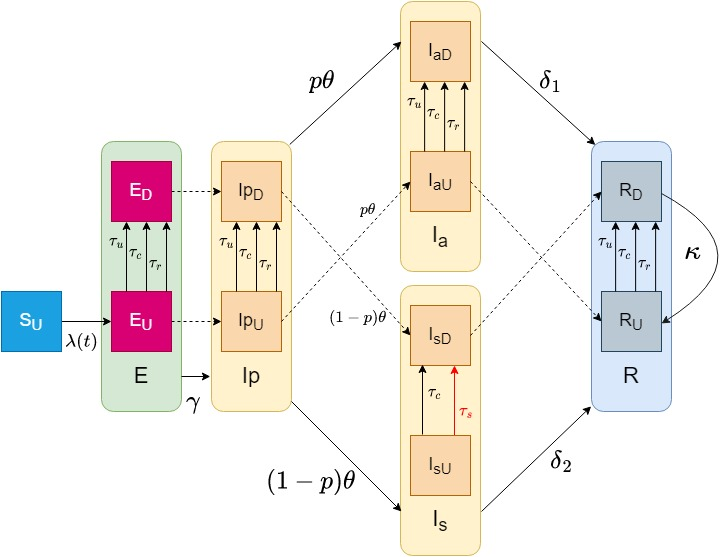

# seirti
# seirti
This repository is intended as a tool to develop an epidemiological compartmental model of the SEIR form, with added compartments for presymtomatic, asymptomatic and symptomatic infectious. And extended to implement testing and isolation by separating each compartment in 2. Below an esquematic figure of the dynamics of the system is presented. 

# System dynamics

The inspiration for this model is taken from Simone et al., [2021](https://journals.plos.org/ploscompbiol/article?id=10.1371/journal.pcbi.1008633), where they build a SEIR-TTI model (testing, tracing, and Isolating). In this project we extend the flexibility on infectious compartments but are not concerned with tracing (yet).

## ODEs

As is usuall for compartmental models, we now will present the ODEs that describe the change of the number of persons in each compartment:

|
Diagnosed
|
Undiagnosed
|
| :-------- | :-----------| 
| $\large\frac{dS_D(t)}{dt} = -\lambda(t)S_D(t)-\kappa S_D(t)+\tau S_U(t)$ | $\large \frac{dS_U(t)}{dt} = -\lambda(t)S_U(t) + \kappa S_D(t)-\tau S_U(t)$ | 
|$\large\frac{dE_D(t)}{dt} = \tau E_U(t) -\gamma E_D(t)$|$\large\frac{dE_U(t)}{dt} = \lambda(t)(S_U(t)+S_D(t)) - \gamma E_U(t) -\tau E_U(t)$|
|$\large\frac{dI_{pD}(t)}{dt}=\gamma E_D(t)-\theta I_{pD}(t)+\tau I_{pU}(t)$|$\large\frac{dI_{pU}(t)}{dt} = \gamma E_U(t) - \theta I_{pU}(t)-\tau I_{pU}(t)$|
|$\large\frac{dI_{aD}(t)}{dt} = \theta p I_{pD}(t) - \delta_1 I_{aD}(t)+\tau I_{aU}(t)$|$\large\frac{dI_{aU}(t)}{dt} = \theta p I_{pU}(t) - \delta_1 I_{aU}(t)- \tau I_{aU}(t)$| 
|$\large\frac{dI_{sD}(t)}{dt} = (1-p)\theta I_{pD}(t) - \delta_2 I_{sD}(t)+\tau I_{sU}(t)$|$\large\frac{dI_{sU}(t)}{dt} = (1-p)\theta I_{pU}(t) - \delta_2 I_{sU}(t)-\tau I_{sU}(t)$|
|$\large\frac{dR_D(t)}{dt} = \delta_1 I_{aD}(t) + \delta_2 I_{sD}(t)+\tau R_U(t)-\kappa R_D(t)$|$\large\frac{dR_U(t)}{dt} = \delta_1 I_{aU}(t) + \delta_2 I_{sU}(t)-\tau R_U(t)+\kappa R_D(t)$|

We assume 1) a constant testing rate $\tau$ randomly applied to all the undiagnosed population. 2) The only diagnosed compartment that does not mean isolated is the suceptible compartment (If an individual is tested and not found sick there is no reason to isolate in a context where there is no contact tracing).  

# Methodology
We intend to use a chain Binomial model, toghether with MCMC to fit the parameters to the model. The methodology used for this purpose is derived following Steven et al., [2021](https://www.sciencedirect.com/science/article/pii/S1755436521000116). Below we present the derivation of the chain Binomial equations:

## Probabilistic equations that govern the inflow of people in a compartment for the next time step

|
Diagnosed
|
Undiagnosed
|
| :-------- | :-----------| 
|$\large S_{D,t+h}^{new}(k)\sim Bin(S_{U,t}(k),1-\exp (-h\tau))$|$\large S_{U,t+h}^{new}(k)\sim Bin(S_{D,t}(k),1-\exp (-h\kappa))$|
|$\large \Delta_{S_{D}->E_{U}}(k)\sim Bin(S_{D,t}(k),p_t^{\*}(k))$|$\large \Delta_{S_{U}->E_{U}}(k)\sim Bin(S_{U,t}(k),p_t^{\*}(k))$|
|$\large E_{D,t+h}^{new}(k)\sim Bin(E_{U,t}(k),1-\exp (-h\tau))$|$\large E_{U,t+h}^{new}(k)\sim \Delta_{S_{D}->E_{U}}(k)+\Delta_{S_{U}->E_{U}}(k)$|
|$\large \Delta_{E_{D}->I_{pD}}(k) \sim Bin(E_{D,t}(k), 1-\exp (-h \gamma))$|$\large \Delta_{I_{pU}->I_{pD}}(k) \sim Bin(I_{pU,t}(k), 1-\exp (-h \tau))$|
|$\large I_{pD,t+h}^{new}(k) \sim \Delta_{E_{D}->I_{pD}}(k) + \Delta_{I_{pU}->I_{pD}}(k)$|$\large I_{pU,t+h}^{new}(k) \sim Bin(E_{U,t}(k), 1-\exp (-h \gamma))$|
|$\large \Delta_{I_{pD}->I_{aD}}(k) \sim Bin(I_{pD,t}(k), 1-\exp (-h p(k)\theta))$|$\large \Delta_{I_{aU}->I_{aD}}(k) \sim Bin(I_{aU,t}(k), 1-\exp (-h \tau))$|
|$\large I_{aD,t+h}^{new}(k) \sim \Delta_{I_{pD}->I_{aD}}(k) + \Delta_{I_{aU}->I_{aD}}(k)$|$\large I_{aU,t+h}^{new}(k) \sim Bin(I_{pU,t}(k), 1-\exp (-h p(k)\theta))$|
|$\large \Delta_{I_{pD}->I_{sD}}(k) \sim Bin(I_{pD,t}(k), 1-\exp (-h (1-p(k))\theta))$|$\large \Delta_{I_{sU}->I_{sD}}(k) \sim Bin(I_{sU,t}(k), 1-\exp (-h \tau))$|
|$\large I_{sD,t+h}^{new}(k) \sim \Delta_{I_{pD}->I_{sD}}(k) + \Delta_{I_{sU}->I_{sD}}(k)$|$\large I_{sU,t+h}^{new}(k) \sim Bin(I_{pU,t}(k), 1-\exp (-h (1-p(k)) \theta))$|
|$\large \Delta_{I_{sD}->R_{D}}(k)\sim Bin(I_{sD,t}(k), 1-\exp (-h \delta_2(k)))$|$\large \Delta_{I_{sU}->R_{U}}(k)\sim Bin(I_{sU,t}(k), 1-\exp (-h \delta_2(k)))$|
|$\large \Delta_{I_{aD}->R_{D}}(k)\sim Bin(I_{aD,t}(k), 1-\exp (-h \delta_1))$|$\large \Delta_{I_{aU}->R_{U}}(k)\sim Bin(I_{aU,t}(k), 1-\exp (-h \delta_1))$|
|$\large \Delta_{R_{U}->R_{D}}(k)\sim Bin(R_{D,t}(k), 1-\exp (-h \tau))$|$\large \Delta_{R_{D}->R_{U}}(k)\sim Bin(R_{D,t}(k), 1-\exp (-h \kappa))$|
|$\large R_{D,t+h}^{new}(k) \sim \Delta_{I_{sD}->R_{D}}(k)+\Delta_{I_{aD}->R_{D}}(k)+\Delta_{R_{U}->R_{D}}(k)$|$\large R_{U,t+h}^{new}(k) \sim \Delta_{I_{sU}->R_{U}}(k)+\Delta_{I_{aU}->R_{U}}(k)+\Delta_{R_{D}->R_{U}}(k)$|

with $p_t^{\*}(k)=1-\exp (-h$ &sum;k=0K $\beta_{asym,U}(k,k') (I_{pU,t}(k')+I_{aU,t}(k')) + \beta_{sym,U}(k,k')I_{sU,t}(k'))$

## Equations for the update of the total number of people in a compartment
    
$\large S_{D,t+h}(k)=S_{D,t}(k)+S_{D,t+h}^{new}(k)-\Delta_{S_{D}->E_{U}}(k)-S_{U,t+h}^{new}(k)$  
    
$\large S_{U,t+h}(k)=S_{U,t}(k)+S_{U,t+h}^{new}(k)-\Delta_{S_{U}->E_{U}}(k)-S_{D,t+h}^{new}(k)$

$\large E_{D,t+h}(k)=E_{D,t}(k) + E_{D,t+h}^{new}(k) - \Delta_{E_{D}->I_{pD}}(k)$
    
$\large E_{U,t+h}(k)=E_{U,t}(k) + E_{U,t+h}^{new}(k) - \Delta_{E_{U}->I_{pU}}(k)-E_{D,t+h}^{new}(k)$
    
$\large I_{pD,t+h}(k)= I_{pD,t}(k)+ I_{pD,t+h}^{new}(k)-\Delta_{I_{pD}->I_{aD}}(k)-\Delta_{I_{pD}->I_{sD}}(k)$
   
$\large I_{pU,t+h}(k)= I_{pU,t}(k)+ I_{pU,t+h}^{new}(k)-\Delta_{I_{pU}->I_{aU}}(k)-\Delta_{I_{pU}->I_{sU}}(k)$
    
$\large I_{aD,t+h}(k)= I_{aD,t}(k)+ I_{aD,t+h}^{new}(k)-\Delta_{I_{aD}->R_{D}}(k)$
   
$\large I_{aU,t+h}(k)= I_{aU,t}(k)+ I_{aU,t+h}^{new}(k)-\Delta_{I_{aU}->R_{U}}(k)-\Delta_{I_{aU}->I_{aD}}(k)$
    
$\large I_{sD,t+h}(k)= I_{sD,t}(k)+ I_{sD,t+h}^{new}(k)-\Delta_{I_{sD}->R_{D}}(k)$
   
$\large I_{sU,t+h}(k)= I_{sU,t}(k)+ I_{sU,t+h}^{new}(k)-\Delta_{I_{sU}->R_{U}}(k)-\Delta_{I_{sU}->I_{sD}}(k)$
    
$\large R_{D,t+h}(k) = R_{D,t}(k) + R_{D,t+h}^{new}(k)-\Delta_{R_{D}->R_{U}}(k)$ 
    
$\large R_{U,t+h}(k) = R_{U,t}(k) + R_{U,t+h}^{new}(k)-\Delta_{R_{U}->R_{D}}(k)$
